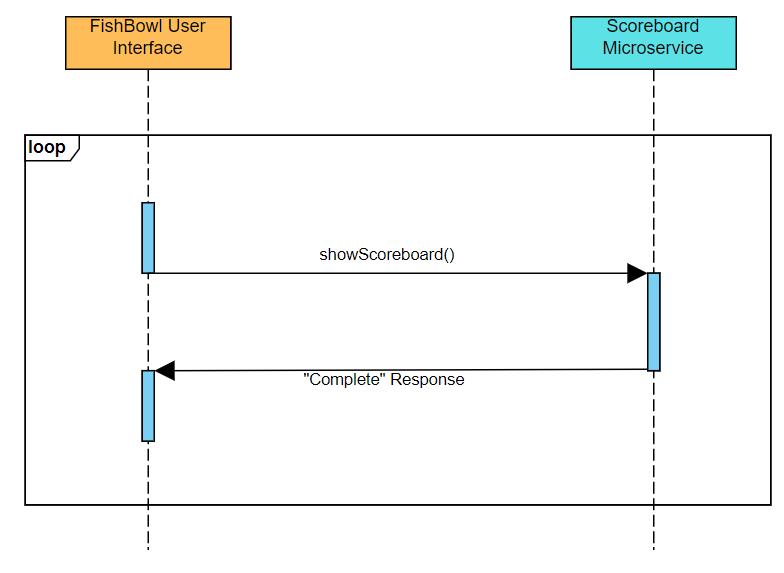

# CS-361-Sprint-2
 Scoreboard Microservice

The Scoreboard microservice takes a list of scores for a game of FishBowl
and produces a scoreboard popup.

Use the following code examples to implement a communication pipeline with
the Scoreboard microservice in your program:

# SOCKET SETUP
Use the following code to initialize a ZeroMQ request socket:

    # Create context

    context = zmq.Context()

    # Connect to "Scoreboard" microservice socket (5000)

    socket = context.socket(zmq.REQ)
    socket.connect("tcp://localhost:5000")

# REQUEST DATA
Use the following code to send a request to the Scoreboard microservice,
containing a list of FishBowl team scores (in order of team number):

    # Prepare a list of team scores

    scores_list = [1,2,3,4]

    # Send list of team scores
    # MUST use .send_json()

    socket.send_json(test_list)

# RECEIVE DATA
Use the following code to receive a response message from the
Scoreboard microservice:

NOTE: The socket MUST receive a response from the response socket
(i.e., the Scoreboard microservice) before it continues execution
to return it to the appropriate state.

    # Save response message to a variable
    # MUST use .recv_string() method

    response = socket.recv_string()

# UML Diagram

